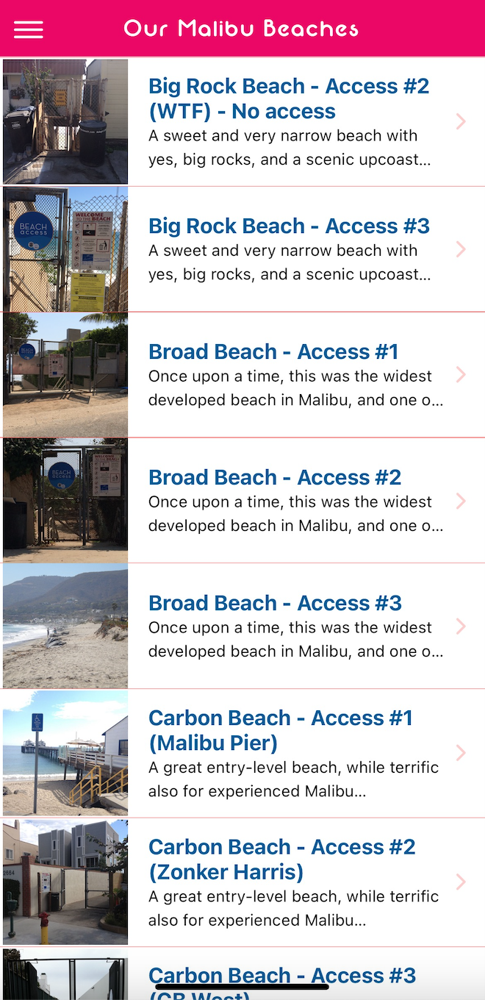
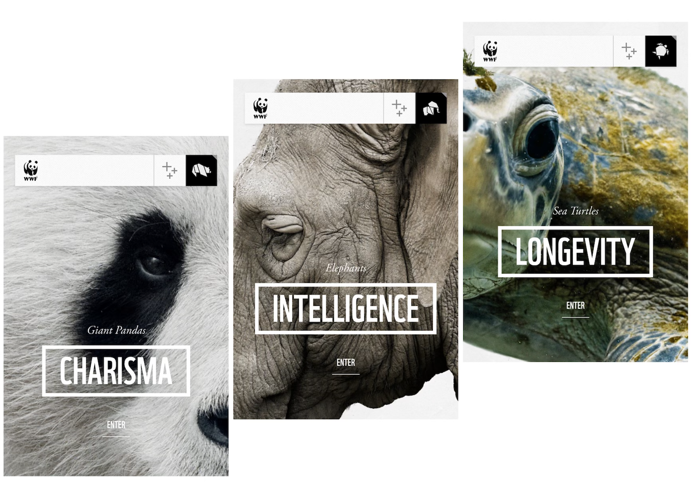
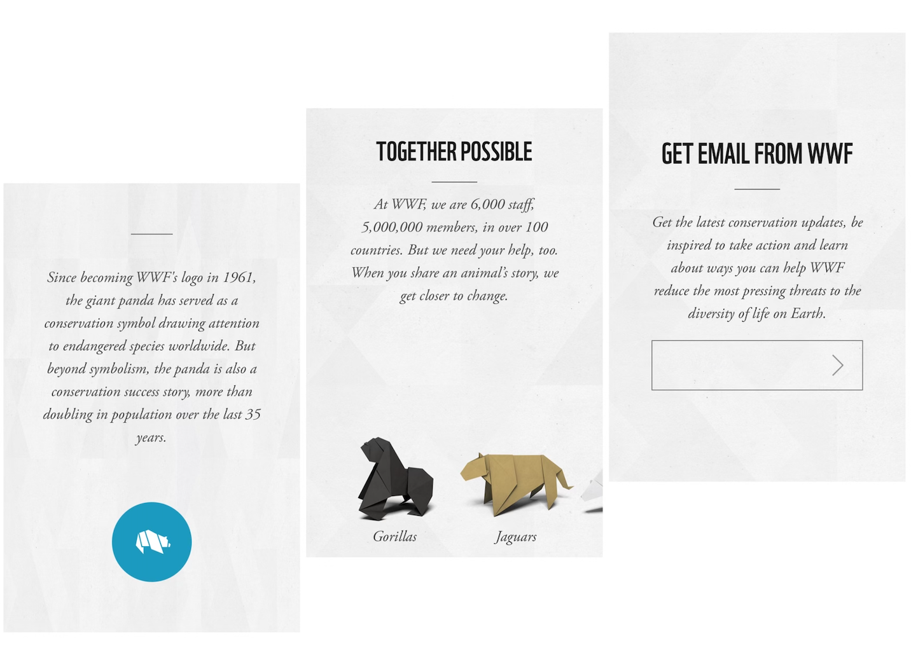
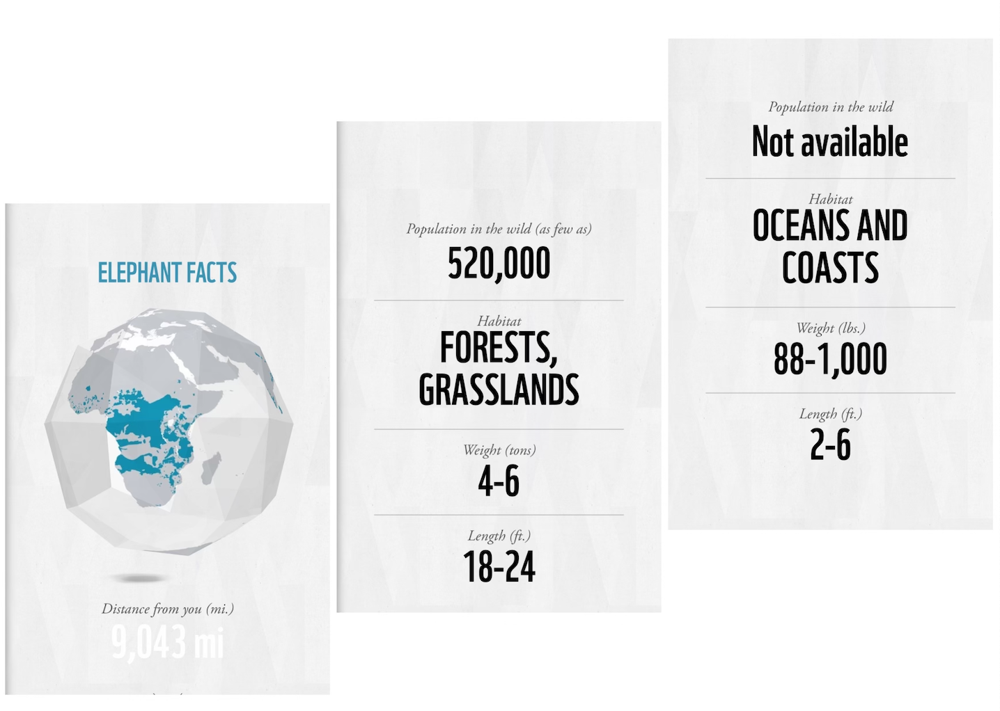
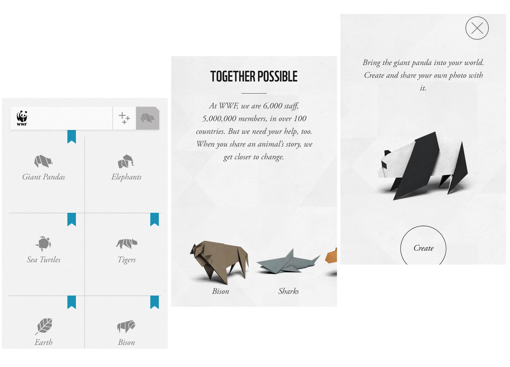

# Sustainable Cities and Communities

## Assignment 1: Heuristic Evaluation

Giovanni Anguiano | DH110 | Fall 2022

### About the project

Although the environment can continue to survive in its natural state, human intervention has caused extensive destruction in many ecosystems. It is very important for us to protect our environment, so that we can continue to live on this planet - in a healthy and safe atmosphere. Healthy ecosystems clean our water, purify our air, maintain our soil, regulate the climate, recycle nutrients and provide us with food. They provide raw materials and resources for medicines and other purposes. They are at the foundation of all civilisation and sustain our economies. Currently, there our hundreds of apps focused on protecting and promoting biodiversity. This project will focus on two apps: Our Malibu Beaches and WWF Together.

### Jakob Nielson's [10 Usability Heuristics](https://www.nngroup.com/articles/ten-usability-heuristics/) Explained

| Number | Heuristic | Description |
|---|---|---|
| 1 | Visibility of System Status | Users should always be informed about what is going; actions are given proper feedback |
| 2 | Match Between System and the Real World | Design uses concepts and language that are familiar and simple to the user |
| 3 | User Control and Freedom | Allow users to make and undo mistakes |
| 4 | Consistency and Standards | Follow conventions and ensure design is consistent throughout the website/app |
| 5 | Error Prevention | Eliminate error-prone conditions and give users safety nets in case of high-cost errors |
| 6 | Recognition Rather Than Recall | Minimize user's memory load by making elements clearly visible or easily accessible |
| 7 | Flexibility and Efficiency of Use | Provide different ways to perform a task to cater to both expert and novice users |
| 8 | Aesthetic and Minimalist Design | Provide only relevant/necessary content and features |
| 9 | Help Users Recognize, Diagnose, and Recover From Errors | Tell users what the problem is and provide solutions to fix it |
| 10 | Help and Documentation | Give users with support to complete their tasks |

### [Severity Ratings](https://www.nngroup.com/articles/how-to-rate-the-severity-of-usability-problems/) for Usability Problems by Nielsen Norman Group

The following rating scale can be used to evaluate the severity of usability issues:
| Rating | Description |
|---|---|
| 1 | Cosmetic problem only: Doesn't need to be urgently fixed unless extra time is available on project |
| 2 | Minor usability problem: fixing this should be given low priority |
| 3 | Major usability problem: important to fix, so should be given high priority |

## Website 1: [Our Malibu Beaches](https://apps.apple.com/us/app/our-malibu-beaches/id565636167)

### About
[Our Malibu Beaches](https://apps.apple.com/us/app/our-malibu-beaches/id565636167) is an app asscociated with the Know What network, a collection of apps that inform people about different the locations around them. Our Malibu Beaches gives users pinpointed directions and tips to access Malibu beaches. Serving as an "owner's manual," users can find information about elusive accessways, parking information, signage information, as well as tide information. What's more, if users have a bad experience with accessing a beach, the app gives instructs on how to report it to the CA Coastal Commission. Additionally, users can learn more about the beaches they're visiting through a facts page. 

The app is full of useful information and interactive features that seem to be be both helpful and confusing. My aim in this evaluation is to preserve the basic foundation while enhancing easier-navigation for the users.

### Heuristic Evaluation

#### 1. Visibility of System Status
* When users launch the app, they are greeted with an interactive map with little sun icons at particular locations that indicate an exisitng public beach. In the top right corner, they'll find a trigram, or "hamburger" symbol that serves as a nagivation menu where they can find a list of beaches with all the necessary information plus more. However, there is no search bar for easy access to a specific beach a user may be inquiring about. Instead, they must sift through the list(s) to find the beach they're looking for. 

> *Recommendation: Include a search bar at the top center of the map that will either immediately locate it on the map for the user so they can tap on it's designated icon and be redirected to its information page or display a drop down tab for them to press and be redirected to its information page. Additionally, it would be good to have results displayed as the user types for even quicker access. This would encourage the user to explore the app more as well.*

#### Severity rating: 2

* There is also a tracking feature that shows your exact location located toward the bottom right corner of the screen. It does not do anything beyond show you exactly where you are, meaning it has no relationship with distance from the beaches (i.e., it does not show you exactly how far you are from the beach your interested in). 

> *Recommendation: Have the tracking feature show users how far they are from a specific beach. Once a user shares their location with the app, it'll show exactly how many miles they are away from their selected beach.

#### Severity rating: 1

#### 2. Match Between System and the Real World
* The app steers clear of using any confusing jargon about accessways or beach information as well as parking information. It maintains the use of colloquial language that can be understood by most. The only criticism is that the language is a bit unprofessional.

* The language isn't necessarily bad. I understand the developers of the app may want to use more lax language to give off the impression or feeling of a friendly or familiar "local," someone who is highly knowledgable about the area. However, it feels too forced and it would just be better to use clear and more professional language. For instance, the sentence "which 'no trespassing' and 'no parking' signs you can smile at and ignore" can be easily and more comprehensibly simplified to "which 'no trespassing and 'no parking' signs you can safely ignore"

> *Recommendation: Simplify and write more clear and professional language to ensure easy comprehension*

#### Severity rating: 1

#### 3. User Control and Freedom
* After a user goes through the list of beaches found in the hamburger nagivation menu, they can select it and go to its information page. However, once they've done so, they cannot return to the place in the list they were just at. Instead, they must go back to the hamburger menu and go through the entire list again. For instance, let's say a user goes through the A-Z list and ends up clicking on "Leo Carillo State Beach." If the user wants to return to where they just were, they have to navigate back to the list using the hamburger menu, where they start at A once again and must scroll all the way down toward L.

> *Recommendation: Add a back button so users don't have to go through the entire sifting process again*

#### Severity rating: 3

#### 4. Consistency and Standards
* The hamburger menu features two lists of beaches: A-Z and E-W. The existence of the A-Z list makes the E-W list completely unnecessary. When a user goes through the E-W list, they'll notice it's the same exact list as the A-Z list, just not in alphabetical order. The existence of the E-W list gives users the illusion of more exploration, when that isn't the case. 

> *Recommendation: Remove the E-W list due to its repetitiveness.*

#### Severity rating: 2

* When users go through different beach information pages, they'll notice some information found on one page cannot be found on another. Some beach's information pages include tide level, parking information, signage information, and even fun facts. Others have nothing but a hyperlink that redirects you to another site that does not always include that same information.

> *Recommendation: Have all pages be consistent with the information it displays. Do not have users redirected to another site to find the information, instead, have it all inegrated within the app. If certain information is unavailable, simply have it say that the information is unavailable for that specifc beach, do not omit that section completely.*

#### Severity rating: 3

#### 5. Error Prevention
* When users use the interactive map, sometimes the app will become very buggy. It slows down and glitches more, sometimes a white bar will appear on the side of the screen and remain there. Other times, the app completely shuts down. The only current solution users have is to close and reopen the app.

> *Recommendation: Adjust the embedded code for the interactive map so it's less buggy*

#### Severity rating: 3

#### 6. Recognition Rather Than Recall
* The interactive map really eliminates the use of recall, which is great! If a user doesn't remember the exact name of a beach, but remembers the general area they were in, they will have an easier time using the map to pinpoint it and find more information. 

* Some beaches have several access points that the apps list. This may confuse some users once they exit a page about a specific access point, they may not be able to remember what access point they were just looking at. Since there is no back button either, they'll have to go through the list again to go back to what they were just viewing.

> *Recommendation: Instead of having different access points have their own designated pages, combine them into one single page with a drop down that the user can toggle through*

#### Severity rating: 1

#### 7. Flexibility and Efficiency of Use
* Currently, there aren't many different ways to perform tasks within the app. The two main ways to access beach information pages is through the interactive map or the lists in the hamburger menu.

> *Recommendation: Previously, in the Visibility Systems Status section, it was recommended that a search bar be created for easier navigation. This recommendation applies here as well, as it will enhance flexibility and efficiency. 

#### Severity rating: 2

#### 8. Aesthetic and Minimalist Design
* The apps does well with keeping a minimalist design. There is not a lot going on and there's a clean hierarchy in terms of headings. The font size is readable and the style is easy on the eyes. However, this does not mean it can't benefit from small redesigns.

> *Recommendation: For a more sleek design, the font style can be changed to something like Serif. This font style gives a modern feel yet maintains readability for good accessibility. In addition, the interactive map could benefit from a mode switch, where users can change the appearance of the map such as in Apple maps.*

#### Severity rating: 1

#### 9. Help Users Recognize, Diagnose, and Recover From Errors
* There aren't any error messages that pop up when an issue occurs and if the app does bug out, users aren't given an option to report it

> *Recommendation: Implement error messages for users and offer solutions so they know how to fix it imnmediately*

#### Severity rating: 3

#### 10. Help and Documentation
* Currently, there is no help page that offers users extra support or a designated page to report any issues with the app. Users are left with visiting the app's page on the app store to write a review.

> *Recommendation: Create a support or help center in the app so users can refer to it when they have any issues.*

#### Severity rating: 3

### Overall Assessment

The Our Malibu Beaches app is an app that's full of useful information. The main issues it has with usability fall under it's organization and function. It suceeds with creativity and minimalist design, but falls short in its consistency and standards. Furthermore, it lacks simple and necessary tools that would enhance usability, such as a search bar and back button. Implementing these small, yet impactful, tools would undoubtedly raise users' experience. There is a lot that needs to be redone, however, it's imperative that the bugs the interactive map brings about are addressed first.

## Website 2: [WWF Together](https://apps.apple.com/us/app/wwf-together/id581920331)

### About
[WWF Together](https://apps.apple.com/us/app/wwf-together/id581920331) is an app created by the World Wildlife Fund (WWF). WWF aims to create a future where people and nature live in harmony. An integral part of the organization is the protection and preservation of wildlife, shielding them from threats like poaching, habitat loss, and overuse of natural resources. The WWF Together apps aims to bring users closer to endangered species by allowing them to discover these species lives and the support WWF offers them. Users can play with interactive features and learn more through weekly-updated wildlife news.

The app boasts innovative design features that are very visually appealing, but there seems to be a lot going on (and more than meets the eye). My aim in this evaluation is to maintain the creative features it has while implementing changes that would enhance them in simple ways.

### Heuristic Evaluation

#### 1. Visibility of System Status
* When users launch the app, they are greeted with an animation that features an origami panda being made. In the background, there is a soundtrack being played (this doesn't appear to be muteable). Users have the option to skip this introduction and be brought to the main homepage.

*On the main homepage, users are shown a picture of a panda and the word charisma. Users can swipe left to see other featured animals. Each animal appears to be associated with a specific word. Below the displayed word, there is an "enter" button. Once pressed, users are redirected the animal's page where they can find facts and an interactive camera feature that places an origami of the animal in your picture with VR.

* There isn't a back button, instead you must press the logo in the top left corner situated in the navigation bar. Once you do so, it takes you to the start page, and once you click start, it plays a slideshow animation of all the animals. This occurs every time you redirect back to the homepage and it's not skippable.

> *Recommendation: Have the slideshow play only once, instead of every time the user redirects to the homepage. While it is visually appealing, it gets tiresome having to wait. Users should have quick access. In addition, have an option for the soundtrack to be muted to allow for total user control.*

#### Severity rating: 1

#### 2. Match Between System and the Real World
* The app uses very simply and professional language that's very comprehensible. It is absent of any confusing wildlife jargon.

* It doesn't include a lot of information about the animals like they lead users to believe. Only short facts. It would be better to include more about the animals that maintains that clear and professional language.

> *Recommendation: Include more information about the animals that still maintains simple and profressional language*

#### Severity rating: 1

#### 3. User Control and Freedom
* There are exit icons for the create feature that allows users to escape from it, but it's only included there

> *Recommendation: Include an exit icon throughout the app so users can escape quickly to the page they were just on instead of having to swipe or summon the navigation bar*

#### Severity rating: 2

* As explained before, if you want to redirect back to the home page, you must click on the logo in the top left corner that's situated in the navigation bar. However, this navigation bar dissappears when you're exploring different pages. To have it come back up, you have to double tap the screen.

> *Recommendation: Instead of having a double-tap feature to summon the navigation bar, have a small back arrow in the corner or have it be a one-tap to summon the navigation bar.*

#### Severity rating: 2

* When the user is sliding through the different animals, one quick/hard swipe will result in a quick toggle through all the animals. In other words, the swip function is very sensitive. 

> *Recommendation: Have the swipe function be more rigid. One quick swipe should only bring the user to the next page, not the very end.*

#### Severity rating: 1

#### 4. Consistency and Standards
* Each animal page is consistent. Each page features a quick summary with facts about the animal. Then there is an interactive globe feature that pinpoints your location and tells you how far the nearest specific animal is from your location. It also details population in the wild, habitat, average weight, and average length. If that information is unavailable, it will tell you so instead of having it omitted. Swiping left shows even more features, suchs as threats to the animal, a "face-to-face" feature that's narrated (and muteable), images of the animal, endangerment category and more. 

* The extra features are not consistent across animal pages. Some include more than others. For instance, there is a lot of information about giant pandas, including gestation period. There's also way more interactive features, including one about their food where you chop bamboo to see the text hidden behind it.

> *Recommendation: Have the same amount of features (especially interactive) across all the animals to ensure interest in all featured animals

#### Severity rating: 1

#### 5. Error Prevention
* When users use the different VR functions, it can cause the app to glitch and get stuck on a gray page. It doesn't seem to shut down though. The only current solution users have is to close and reopen the app.

> *Recommendation: Adjust the code for the VR functions so it's less buggy*

#### Severity rating: 3

#### 6. Recognition Rather Than Recall
* The app has a lot of features, but most of them aren't apparent. You figure it out as you explore. For instance, when you go to an animal's page, there is a blue button with the animal icon. When you press and hold, it plays what the animal sounds like. There is no tutorial guide on navigation so you must remember how everything is set up. There is only a quick tutorial that appears once in the beginning about swiping left on the mainpage.

> *Recommendation: Implement a tutorial guide for first-time users so they know how to work everything in the app instead of having them figure it out themselves.*

#### Severity rating: 2

#### 7. Flexibility and Efficiency of Use
* The app has a camera feature that will place a virtual origami of the animal in the picture. There are multiple ways to access this: quick access using the + button, swiping to the end of an animal's page, and an icon with pluses on the navigation bar.

* To navigate through all the animal pages, the user can either swipe through or click on the top right corner icon and see a grid where they can select themselves. However, navigating back is a bit more tedious because you have to go through the navigation bar instead of having a quick exit

> *Recommendation: include quicker escape options so navigation options become more accesible.*

#### Severity rating: 2

#### 8. Aesthetic and Minimalist Design
* The apps does well with keeping a minimalist design. It's very sleek and has a modern feel to it. However there are a lot of features that are not intuitive. 

* The font color at times does have a good contrast. For instance, there may be light white text on a white background, making it difficult to read.

> *Recommendation: Have better contrast between text color and background color to enhance readability.*

#### Severity rating: 2

* There is a lot of swiping going on that the user may not realize is available. When you enter a page, you must swipe to the left, then down then to the left again to see other features, making the feel more hidden. 

> *Recommendation: Add a progress bar of sorts on the bottom to let users know there's more for them to explore.*

#### Severity rating: 2

* Some features are interactive but don't present themselves as so. As previously mentioned, there was an interactive page in the pandas page where you chop bamboo to see the text hidden behind it. There was no indication to swipe to chop, the only unstruction given was "grow." Other animal pages were more clear about it, such as in the elephant's page where you "smear" the interactive button around the screen.

#### Severity rating: 2

* The app says there is weekly wildlife news, but I still cannot find it. Either it doesn't exist or it's hidden elsewhere. It may be sent through an emial listing that they offer.

> *Recommendation: Have the weekly news integrated into the app and situated in the navigation bar denoted with a newspaper icon to make it easy to find.*

#### Severity rating: 2

* In the face-toface feature, there is an narration that is muteable, but does not include a transcript.

> *Recommendation: Include a trasncript for better accessibility.*

#### Severity rating: 3

#### 9. Help Users Recognize, Diagnose, and Recover From Errors
* There aren't any error messages that pop up when an issue occurs and if the app does bug out, users aren't given an option to report it

> *Recommendation: Implement error messages for users and offer solutions so they know how to fix it imnmediately*

#### Severity rating: 3

#### 10. Help and Documentation
* Currently, there is no help page that offers users extra support or a designated page to report any issues with the app. Users are left with visiting the app's page on the app store to write a review.

> *Recommendation: Create a support or help center in the app so users can refer to it when they have any issues.*

#### Severity rating: 3

### Overall Assessment

The WWF Together app is an app with amazing design features and pushes important narratives about wildlife forward. While it does have cool features, most of its usability issues do actually fall under the design aspect. The navigation bar while useful, isn't always the most accessible. The double-tap summon feature could be turned into a one-tap or even a back button in other instances throughout the app. Some text is hard to read due to font color and background color. While it's interactive features are stunning, they aren't intuitive and require more instruction. Moving through the app takes a lot of swiping and some information can't even be found. Its unskippable slideshow animations are amazing, but quickly get old. If these recommendations are implemented, the app would definitely be top-tier!
