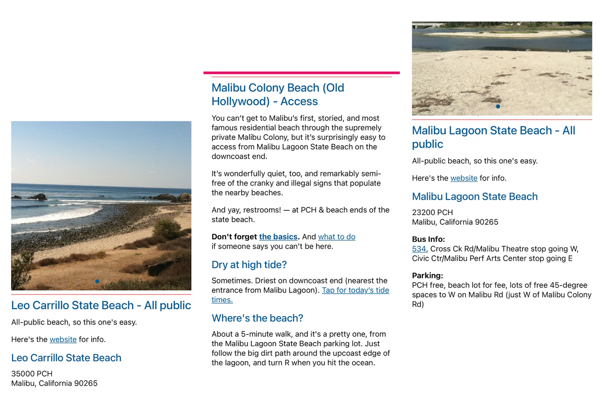

# Sustainable Cities and Communities

## Assignment 1: Heuristic Evaluation

Giovanni Anguiano | DH110 | Fall 2022

### About the project

Although the environment can continue to survive in its natural state, human intervention has caused extensive destruction in many ecosystems. It is very important for us to protect our environment, so that we can continue to live on this planet - in a healthy and safe atmosphere. Healthy ecosystems clean our water, purify our air, maintain our soil, regulate the climate, recycle nutrients and provide us with food. They provide raw materials and resources for medicines and other purposes. They are at the foundation of all civilisation and sustain our economies. Currently, there our hundreds of apps focused on protecting biodiversity. This project will focus on two apps: Our Malibu Beaches and WWF Together.

### Jakob Nielson's [10 Usability Heuristics](https://www.nngroup.com/articles/ten-usability-heuristics/) Explained

| Number | Heuristic | Description |
|---|---|---|
| 1 | Visibility of System Status | Users should always be informed about what is going on and should be given appropriate feedback to their actions |
| 2 | Match Between System and the Real World | Use concepts and language that are familiar and logical to the user |
| 3 | User Control and Freedom | Allow users to make mistakes; give them options to undo and redo tasks |
| 4 | Consistency and Standards | Follow conventions and make sure design is consistent across the platform |
| 5 | Error Prevention | Get rid of error-prone conditions and provide users with safety nets for high-cost errors |
| 6 | Recognition Rather Than Recall | Minimize user's memory load by giving them suggestions and help in context |
| 7 | Flexibility and Efficiency of Use | Provide multiple ways to perform a task to make the platform accessible to all users |
| 8 | Aesthetic and Minimalist Design | Provide only relevant content and features |
| 9 | Help Users Recognize, Diagnose, and Recover From Errors | Tell users what the problem is and provide suggestions to fix it |
| 10 | Help and Documentation | Supply users with extra help to complete their tasks |

### [Severity Ratings](https://www.nngroup.com/articles/how-to-rate-the-severity-of-usability-problems/) for Usability Problems by Nielsen Norman Group

The following rating scale can be used to evaluate the severity of usability issues:
| Rating | Description |
|---|---|
| 1 | Cosmetic problem only: need not be fixed unless extra time is available on project |
| 2 | Minor usability problem: fixing this should be given low priority |
| 3 | Major usability problem: important to fix, so should be given high priority |

Ratings are displayed in parentheses after each usability issue.

## Website 1: [Our Malibu Beaches](https://apps.apple.com/us/app/our-malibu-beaches/id565636167)

### About
[Our Malibu Beaches](https://apps.apple.com/us/app/our-malibu-beaches/id565636167) is an app asscociated with the Know What network, a collection of apps that inform people about different the locations around them. Our Malibu Beaches gives users pinpointed directions and tips to access Malibu beaches. Serving as an "owner's manual," users can find information about elusive accessways, parking information, signage information, as well as tide information. What's more, if users have a bad experience with accessing a beach, the app gives instructs on how to report it to the CA Coastal Commission. Additionally, users can learn more about the beaches they're visiting through a facts page. 

The app is full of useful information and interactive features that can be both helpful and confusing. My aim in this evaluation is to preserve the basic foundation while enhancing easier-navigation for the users.

### Heuristic Evaluation

#### 1. Visibility of System Status
* When users launch the app, they are greeted with an interactive map with little sun icons at particular locations that indicate an exisitng public beach. In the top right corner, they'll find a trigram, or "hamburger" symbol that serves as a nagivation menu where they can find a list of beaches with all the necessary information plus more. However, there is no search bar for easy access to a specific beach a user may be inquiring about. Instead, they must sift through the list(s) to find the beach they're looking for. 

> *Recommendation: Include a search bar at the top center of the map that will either immediately locate it on the map for the user so they can tap on it's designated icon and be redirected to its information page or display a drop down tab for them to press and be redirected to its information page. Additionally, it would be good to have results displayed as the user types for even quicker access. This would encourage the user to explore the app more as well.*

* There is also a tracking feature that shows your exact location located at toward the bottom right corner of the screen. It does not do anything beyond show you exactly where you are, meaning it has no relationship with distance from the beaches (i.e., it does not show you exactly how far you are from the beach your interested in). 

>*Recommendation: Have the tracking feature show users how far they are from a specific beach. Once a user shares their location with the app, it'll show exactly how many miles they are away from their selected beach.

#### Severity rating: 2

#### 2. Match Between System and the Real World
* The app steers clear of using any confusing jargon about accessways or beach information as well as parking information. It maintains the use of colloquial language that can be understood by most. The only criticism is that the language is a bit unprofessional.

* The language isn't necessarily bad. I understand the developers of the app may want to use more lax language to give off the impression or feeling of a friendly or familiar "local," someone who is highly knowledgable about the area. However, it feels too forced and it would jsut be better to use clear and more professional language. For instance, the sentence "which 'no trespassing' and 'no parking' signs you can smile at and ignore" can be easily and more comprehensibly simplified to "which 'no trespassing and 'no parking' signs you can safely ignore"

> *Recommendation: Simplify and write more clear and professional language*

#### Severity rating: 1

#### 3. User Control and Freedom
* After a user goes through the list of beaches found in the hamburger nagivation menu, they can select it and go to its information page. However, once they've done so, they cannot return to the place in the list they were just at. Instead, they must go back to the hamburger navigation menu and go through the entire list again. For instance, let's say a user goes through the A-Z list and ends up clicking on "Leo Carillo State Beach." If the user wants to return to where they just were, they have to navigate back to the list using the hamburger menu, where they start at A once again and must scroll all the way down toward L.

> *Recommendation: Add a back button so users don't have to go through the entire sifting process again*

#### Severity rating: 3

#### 4. Consistency and Standards
* The hamburger menu features two lists of beaches: A-Z and E-W. The existence of the A-Z list makes the E-W list completely unneccesarry. When a user goes through the E-W list, they'll notice it's the same exact list as the A-Z list, just not in alphabetical order. The existence of the E-W list gives users the illusion of more exploration, when that isn't the case. 

> *Recommendation: Remove the E-W list due to its repetitiveness.*

* When users go through different beach information pages, they'll notice some information found on one page cannot be found on another. Some beach's information pages include tide level, parking information, signage information, and even fun facts. Others have nothing but a hyperlink that redirects you to another site that does not always include that same information.

> *Recommendation: Have the all pages be consistent with the information it displays. Do not have users redirected to another site to find the information, instead, have it all inegrated within the app. If certain information is unvailable, simply have it say that information is unavailable for that specifc beach, do not omit that section completely.*

#### Severity rating: 3

#### 5. Error Prevention
* When users use the interactive map, sometimes the app will become very buggy. It slows down and glitches more, sometimes a white bar will appear on the side of the screen and remain their. Other times, the app completely shuts down. The only current solution users have is to close and reopen the app.

> *Recommendation: Adjust the embedded code for the interactive map so it's less buggy*

#### Severity rating: 3

