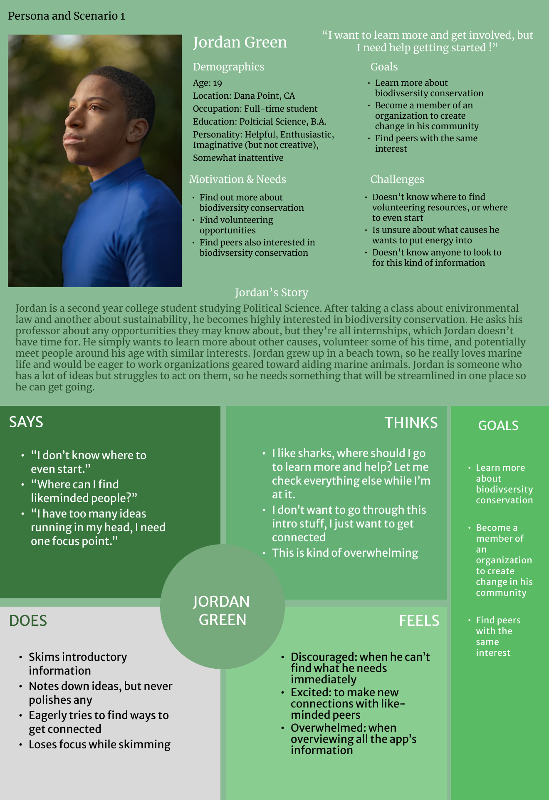
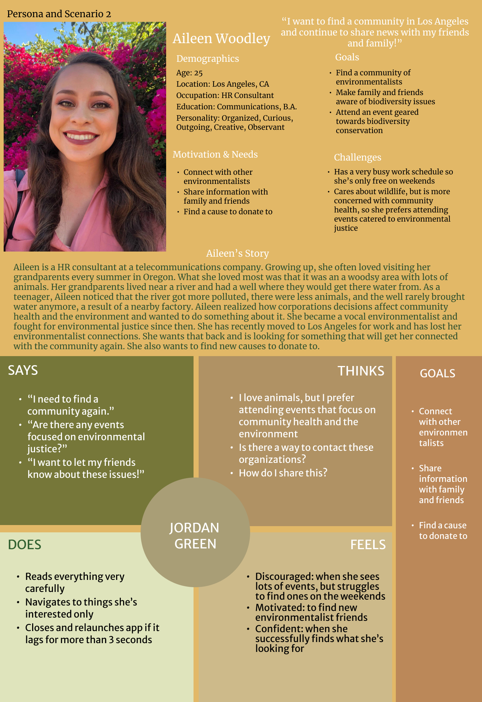

# Personas and Scenarios

### The Purpose of Storytelling

UX Storytelling emphasizes to user researchers and designers that the experience must be human-centered. It allows researchers to go beyond heuristic principles and data analysis and gets at the core of who these users are, their motivations, and their needs. By knowing these things, we are better able to create a product that leaves users highly satisfied. With the use of personas, it allows me to understand the target users on a deeper level so I can see how the current system falls short of their goals.

### Design Features 

Based on my previous research, I plan to implement 3 design features that I believe will help users feel incentivized to get more involved in biodiversity conservation and find more opportunities to share.

* **Filter function:** Give users filter options that allows them to curate what they're looking for based on location, event-type, oganization-type, and time. This allows users to narrow down their choices and maximize their time.
* **Volunteer and Networking Opportunities tab:** Many users express struggling with finding volunteer and networking opportunites on the internet or in-person. They aren't quite sure where to look or who to ask. With this feature, users can find that all in one place with links that redirect them to the opportunities.
*  **Sharing Function:** Gives users the option to sahre anything they see within the app, whether it be wildlife information, a news article, a volunteer opportunity, or even a picture. Users are given multiple methods of sharing, such as messages, email, Instagram, Facebook, Twitter, and Snapchat. 

### Persona & Empathy Map

#### Jordan Green

#### Aileen Woodley

### Scenarios & Journey Map

#### 1. Jordan's Scenario

*	Jordan has just finished taking an environmental law course as well as an Earth Science course about sustainability. In these classes, he learned about the detrimental effects of human pollution stemming from individuals and large corporations. Jordan grew up in a beach town so it really hit home and he was motivated to get involved. He also saw the opportunity of finding likeminded peers to grow his interests. He asked his professors if they knew of any opportunities Jordan could look into. They both responded with internship opportunities. These internships were extremely difficult to obtain due to competitiveness and they took up a lot of time, which Jordan didn’t have. He had just started to become interested in this topic so he didn’t want to bite off more than he could chew. He thanked them for bringing up the opportunities to him and left. 
*	Later that night, Jordan started doing his own research, but he wasn’t getting much progress. Jordan is the type to have many ideas, but can never act on them because he gets overwhelmed with all the options he’s generated for himself. Trying to slow down, he opts to research about sharks because he loves them. He wants to learn information about the species, its habitat, if its endangered or not, and the threats it faces in the wild. Additionally, he wants to find any organizations that cater to protecting sharks and any volunteer opportunities that are out there. He is having to reference so many websites just to find what he’s looking for. He’s more of a skimmer so he ends up missing lots of details in the texts he’s reading. He then starts to feel overwhelmed. He shuts his laptop and retires to bed.
*	That same weekend, Jordan’s friends invite him out to a party. Jordan delightfully agrees to go and heads out with his friends at night. At the party, Jordan is chatting it up with new people and making new connections. After being asked about his interests, he brings up his newfound interest in biodiversity conservation. He expresses how exciting and valuable it seems, but how difficult and overwhelming it feels to break into it. He just wants to find it all in one place and be given options to volunteer, especially with those in his peer group.  One girl at the party, Angela, overhears him and joins the conversation. She listens to his frustrations and excitedly tells him about the WWF Together app. She explains to him that the app is exactly what he’s looking for. It has all the information in one single place for users to search through and provides users with volunteer opportunities.
*	The next day, he downloads the app and starts exploring. He finds that the app has a filter function so he can quickly parse through everything to find what he’s looking for. He first tries it out by looking for information about elephants. He’s given basic elephant information, organizations geared toward protecting them, volunteer opportunities based on helping elephants, and more. He gets really excited and finds two eco-events that are targeted at his age group. He selects the events and hits the “I plan to attend” button. Once he does this, he’s asked for his email so that he can receive all the necessary information. Afterward, he explores different non-profit organizations, particularly ones that help marine life. He looks forward to becoming an active member in one of them soon. 

#### 2. Aileen's Scenario

*	Growing up, Aileen loved visiting her grandparents in Oregon every summer. She loved it so much because it was in a woodsy area and there was so much wildlife. Her grandparents lived near a river and even had a well for them to get water from. As a teenager, she started noticing the river got more and more polluted and there was less wildlife. She asked her grandpa what was happening and he said it had to do with a nearby factory that was dumping into the river and polluting the water. This river, he explained, is important to the ecosystem. Because it’s now polluted, many fish have died and there are less animals around. Additionally, the air pollution the factory contributed was causing health problems for the nearby community. Aileen realized then how corporations decisions affect community health and the environment and she sought to fight against it and make change. She’s since then been a vocal environmentalist and fights for environmental justice. She has cultivated a strong community with other environmentalists and attends events with them together. 
*	Now at 25, Aileen has had to make a move to Los Angeles because of a new job opportunity. Because of this, she has of course had leave her community behind her. She’s really upset over it, but is determined to find a new one in Los Angeles. At her new job, she is overwhelmed with work and is always busy. Her only time for herself is during the weekend. During one of these weekends, she attempts to research any environmental networking events or symposiums to meet new people. She specifically wants to find events geared towards environmental justice and community health. As she’s searching, she finds that most events are mostly happening during the weekday. Additionally, the majority of the events are geared toward wildlife issues, such as fundraisers for endangered Bison. She cares about those issues as well, but would prefer to dedicate her time to what she’s actually interested in. After hours of searching, she gives up and has some dinner.
*	After her dinner, she decides to call a friend from back home, an environmentalist she always worked with. She expresses how she’s struggling to find opportunities to connect with other environmentalists in Los Angeles and events that align with her schedule. Additionally, she’s been wanting to find local causes to donate to, but she doesn’t know where to find it. She tells her that there’s so many results to sift through that her eyes end up being so strained. She wishes she could just find what she wants. Her friend validates her feelings and excitedly tells her about the perfect solution: the WWF Together app. She tells her that the app provides users with wildlife information, a weekly newsletter on biodiversity updates, but most importantly a volunteer and networking opportunities tab and links for donation which is exactly what she’s looking for. Aileen’s jaw drops and is shocked she hadn’t heard about it. She thanks her friend and says goodnight
*	The next morning, Aileen downloads the app and starts working through it. She quickly finds the filter function and sees she can find things based on location, event-type, organization-type, and more. She quickly applies her needs and finds about 30 results just within that month. She’s over the moon!  She starts looking into different organizations and sees what different ongoing campaigns they have. She notices that there are “donate now” buttons next to the campaigns so she can easily donate. She feels so giddy. She then quickly notes down what she events she wants to attend and sees the “I plan to attend” button, she presses it and enters her email to receive all the information. Once she does so, she notices that she can share the event with others through various methods. She hadn’t mentioned it to her friend, but this was another thing she was looking for! It was so quick and easy and she could send it to multiple people at once. She realizes that she can change the location to her hometown and send her friends events that they may not be aware of as well. She starts to do so and feels so satisfied. She feels grateful for being introduced to the app.

### Reflection

 *	At first I felt extremely intimidated by the idea of having to create personas and using figma to do it. It is all so new/foreign to me so I felt a lot of pressure. But after playing around with it, it made me realize that it is very similar to some editing apps that I use on my phone, like Picsart. I’ve always loved editing photos on my phone and making creative graphics for fun, I even created an entire zine project on my phone. Once I realized I wasn’t a stranger to figma after all, it all started to come together much quicker. 
*	As for actually coming up with stories for the personas, I didn’t find it too hard. I can be very imaginative when it comes to things like that and always loving coming up with random stories for people on the street. Giving them background stories with the use of their journey maps was very fulfilling. When it came to creating challenges for the personas, I had to think a bit more about what I’m truly trying to accomplish and implement to my app. My app is already very well designed so I needed to be more creative. When I looked back assignment 3, I realized my participant mentioned a lot of struggle with finding resources. It can be very intimidating for people as they try to break into a new field. This is when I had the idea to implement a tab completely dedicated to volunteering and networking. I additionally wanted users to have the option to share any and everything on the app, not just photos you take yourself. 
*	I feel like a limitation for this assignment was not providing more additional information on the persona profiles. I noticed in student examples that they included things like the users favorite books or brands (like the articles the professors suggested in the outline). I didn’t really know what to include for that for my personas since my project isn’t something like a book logging app or movie logging app. I didn’t know if it was entirely necessary. Maybe including causes they’re highly interested in would be nice. 
*	Through this assignment, I was able to understand how my app should have the primary aim of resolving any frustrations or intimidations a user has with getting involved and how they can let others know about what they’re involved in from a user-centric approach.
