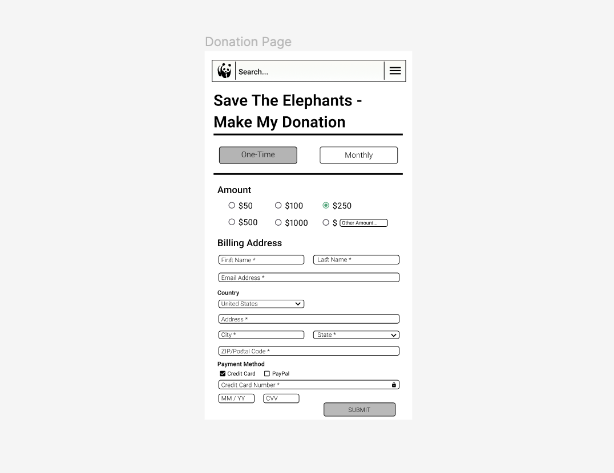
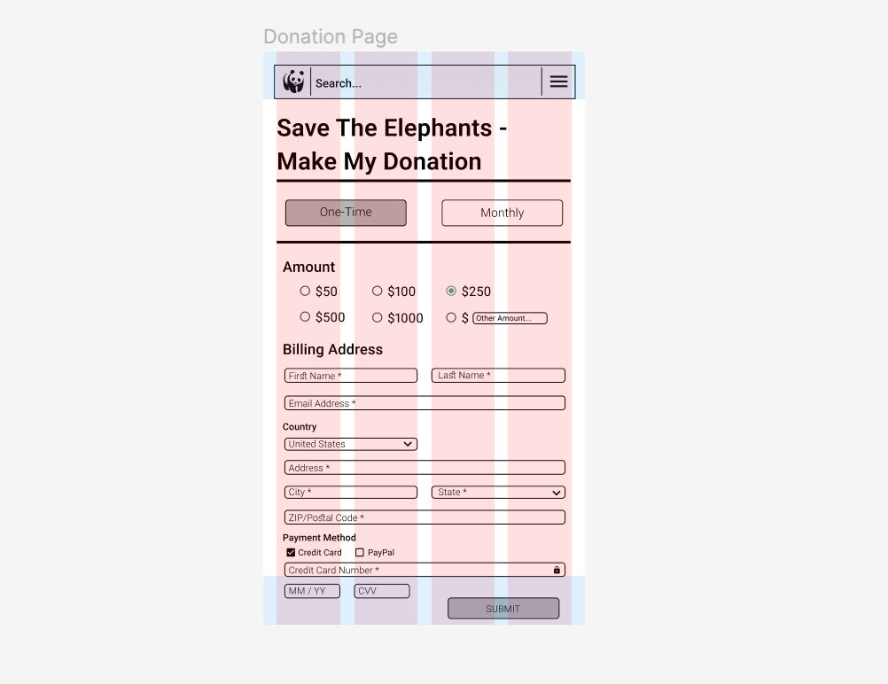
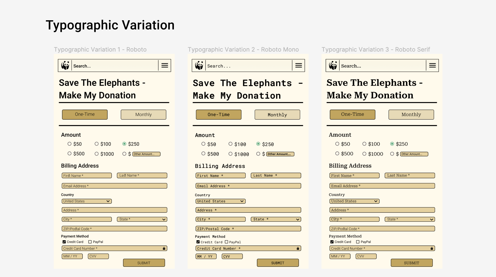
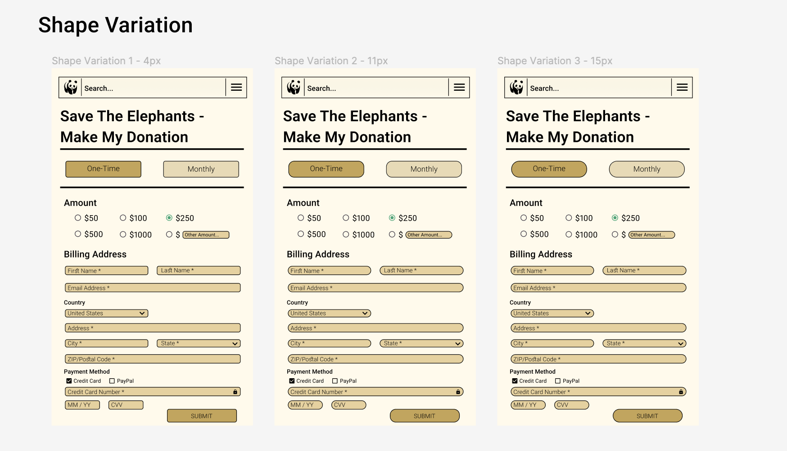
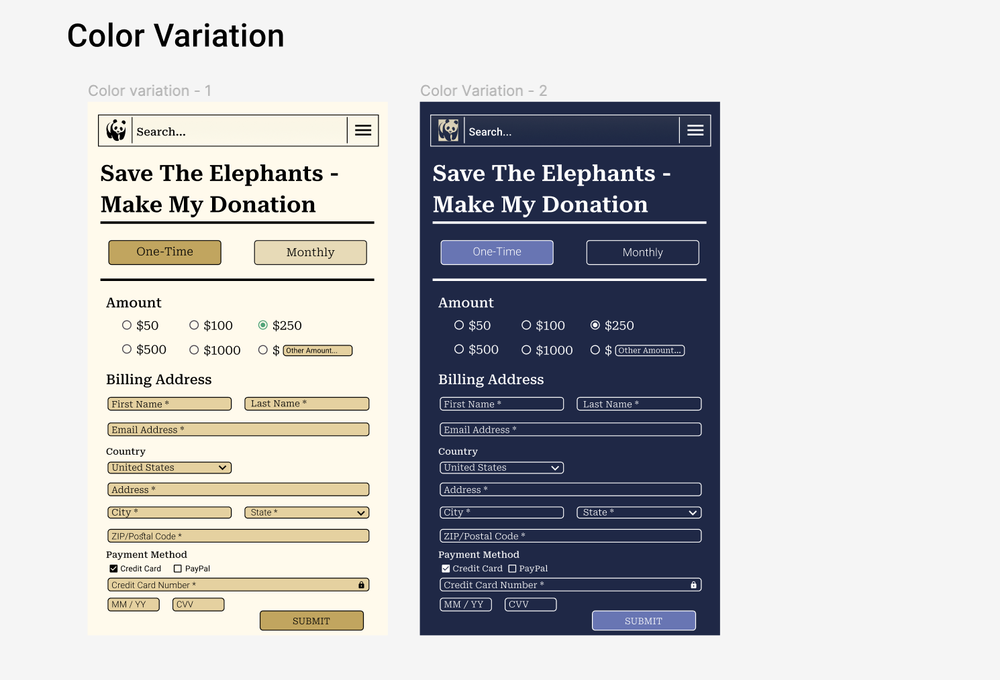
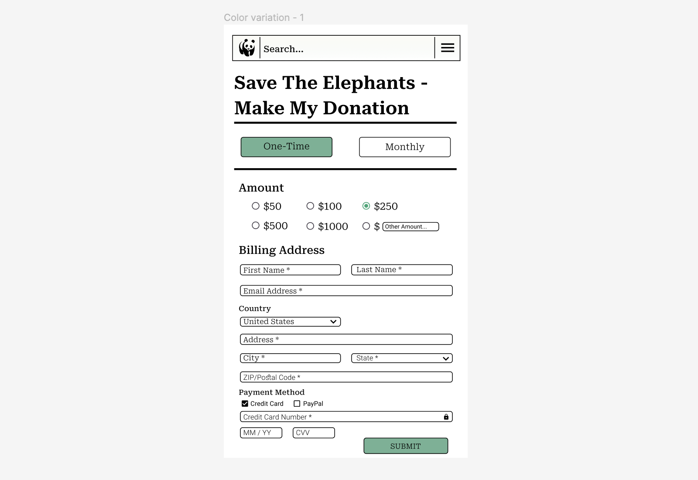
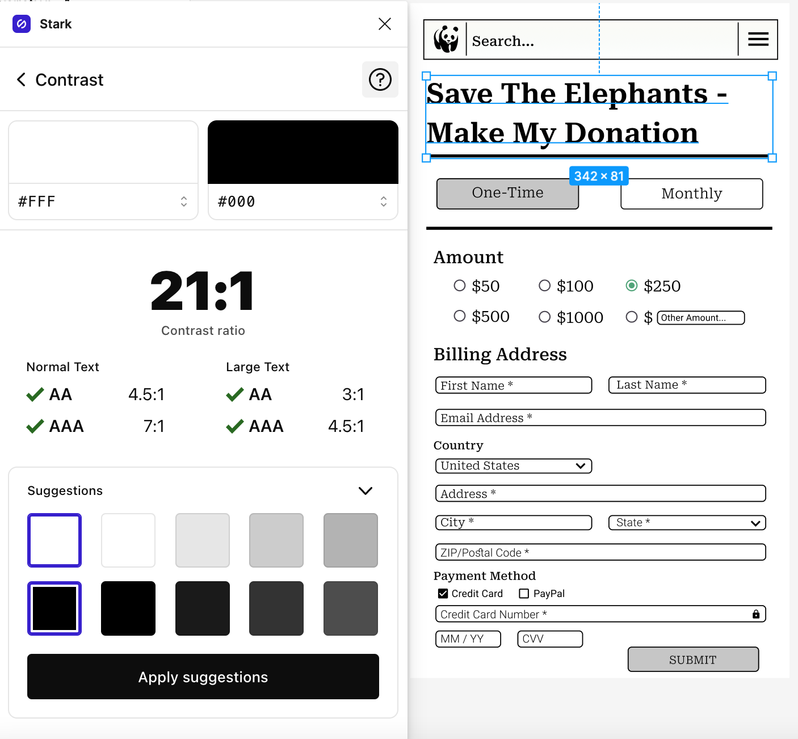
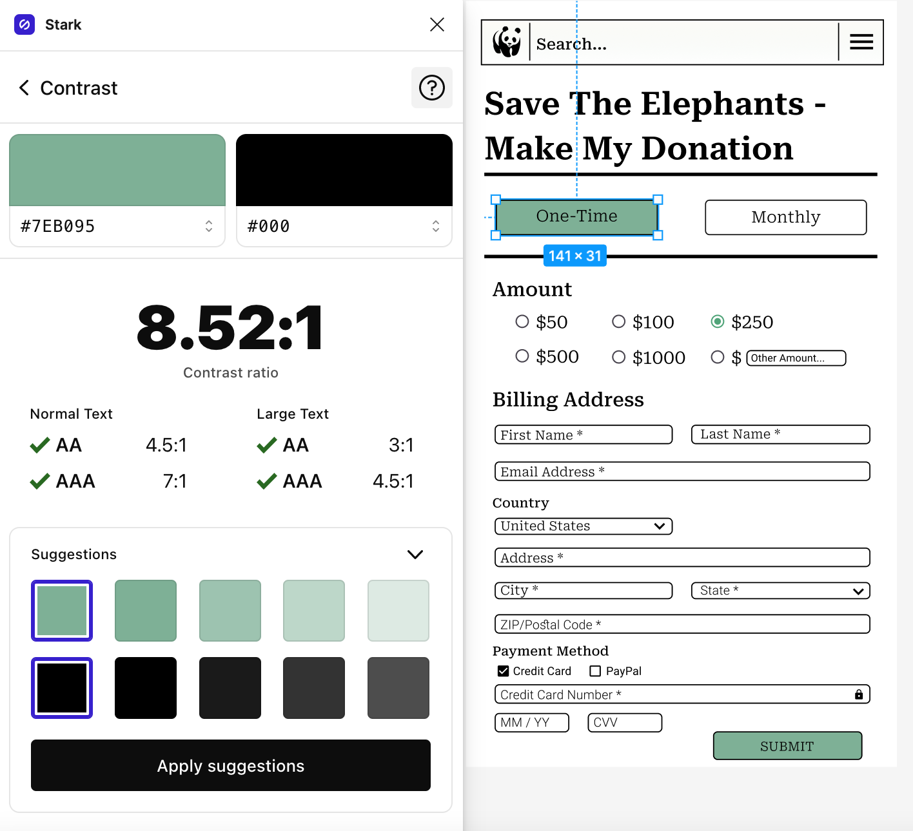
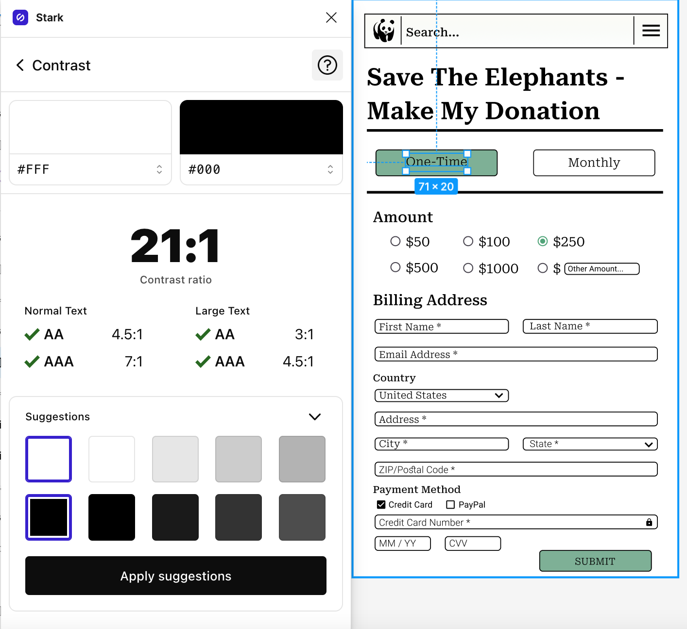
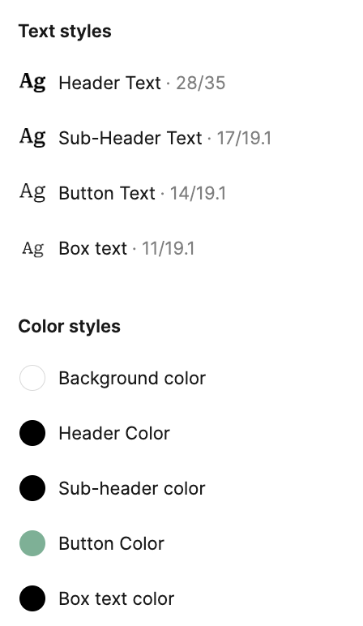

# Assignment #6: Interface Design System

**Giovanni Anguiano** | *Digital Humanities 110 - User Interface and Design* | Spring 2022

---

## Description of Project

The aim of this project is to redesign WWF Together’s current interface to make is more accessible and easier to navigate. Additionally, the redesign will implement new features that will allow users to delve deeper into the sphere of biodiversity conservation. Some of these features include volunteer and networking opportunities and finding causes to donate to. In this specific demonstration, the design focuses on the donation page aspect of the app. The purpose of this interactive prototype is to visualize the donation page in order to create a visual skeleton and basic concepts of interactions. This will ultimately serve as a resource for usability testing that will help configure solutions throughout the entire design process. 

This interactive prototype is the digitalized and high-fidelity version of the paper prototype. It was created using Figma. After digitalizing the paper wireframes, small frames were transferred and scaled to the phone model (iPhone 8). After the transfer, a grid was utilized to to determine the best structure. Then, the typography styles of all texts were determined. These decisions informed the shapes and sizes of the buttons and icons. After completing all the structural parts of the grey-scale wireframes through several rounds of iterations, a color scheme was developed (a light and dark theme) that would be fitting for the intention of this app.

### Links to Figma file and prototype

- [Figma file](https://www.figma.com/file/aXirTq3xskgszB6fJ6K7N7/Untitled?node-id=0%3A1&t=uckUY0MNbq6oV2zi-1)

- [Digitized Wireflow](https://www.figma.com/file/A6TIjtT88Z6jO09k44Zn08/LoFi-Prototype?node-id=0%3A1&t=bNjeppZZ1DgzpCZc-1)

### Chosen Wireframe

## Screen Design

### Layout

### Typographic Variations

For this design, **Roboto** fonts were chosen as it was determined that it would be best for its readability. Three fonts are compared: Roboto, Roboto Mono, and Roboto Serif.

When comparing the three, I decided that I would want to use **Roboto Serif**, because it was the most modern and elegant font out of the three.

---

### Shape Variations

Throughout my design, I had **rounded corners** on my rectangles for **buttons, search input, and assets**. The three variations include 4px, 11px, and 15px. I thought that 11px was the most fitting radius size for the final design.

---

### Color Variations

I created a light and dark mode of the design, with some changes in the color palette depending on its usage on light/dark mode.

---

## Impression Testing

I showed my product to the same person I did contextual interviews with. First, I did a 5 second test and showed the design for 5 seconds. After the 5 second test, I asked them for their first impressions and what they could remember about the website. The following are their first impressions:

### 5-second-test findings

**Overall Impression:**
> The user could immediately identify what the purpose of the app page was. They could also immediately tell that it was a a biodiversity-related app based on the the icon.

**Typography:**
> The user preferred fonts that were professional but not “too basic” to look at. He did not like the Robotic Mono variation at all and said it made it look dated.

**Shape:**
> The user immediately indicated their liking for the 4px and stated that the other two felt “off.” The user stated that the 15px variation was “almost too round” and didn’t make the page look “as sleek.” Furthermore, the 11px variation was “nice, but compared to the 4px variation, it comes second.”

**Color Scheme:**
> The user preferred the dark mode design over the light mode. They stated that they were more used to using dark mode, citing a personal bias in their aesthetic interests. They particularly liked the button colors contrasted to the dark background. They also pointed out that the color scheme for light mode could just be black and white, stating that it would look more sleek that way.

Direct Quotes from Impression Test:

> “The dark mode looks amazing, but I say that because I just love dark mode for everything. Makes everything look better. I like the light mode too, but dark mode makes it feel more sleek”

> “I like the drop down menu thing for the country and state. I also really like the options for the donation amounts, like the other amount option is really cool”

> “The organization of the entire page is perfect”

> “The color scheme for light mode is nice, but honestly, the page would look better if it was just black and white. Taking that color scheme would make it look more sleek and professional. Maybe if you don’t want it to be boring, a textured white background would be cool”

### Final Design

Following the impression test, I made some changes to the final design. Namely, the background color. It was changed from a light ivory to an eggshell white. Additionally the button colors were changed to a green color as it falls under the typical color schemes of enrvironmental-related design. I made the green a bit more mute so it is softer on the eyes.

## Accessibility + Contrast Check

### Text vs Background

### Button vs Background

### Button Label vs Button

## Design System

* Typeface:
    * Family: Roboto
        * Header: SemiBold, Size 28
        * Button Labels: Light, Size 14
        * Body: Regular, Size 15
        * Box Text: Light, Size 11
* Color Scheme:
    * Header Color: 000000
        * Subheader / Text Color: 000000
        * Button Color: 7EB095
        * Background Color: FFFFFF
* Layout Grid:
    * 4 columns by 2 rows
        * Columns:
            * Margins: 16
            * Gutter: 16
        * Rows:
            * Height: 56
            * Gutter: 1
## Design Decisions 

Color Scheme:
I changed the colors per the user’s suggestions. This color scheme actually aligns with the current app’s interface (black and white). The green was made more muted to avoid being harsh on the eyes.

Typeface:
I chose to go with Roboto Serif because that is the font that the user preferred out of the options I presented. I liked both letter casing for Roboto Serif as well as its readability. I made the font size 15 for the body as to be pretty standard for users skimming through information.

Layout Grid:
I chose layout grid 2 rows and 4 columns because I am designing a mobile phone app and found that having a fewer number of both allowed me more flexibility and precision in placement of various components.
