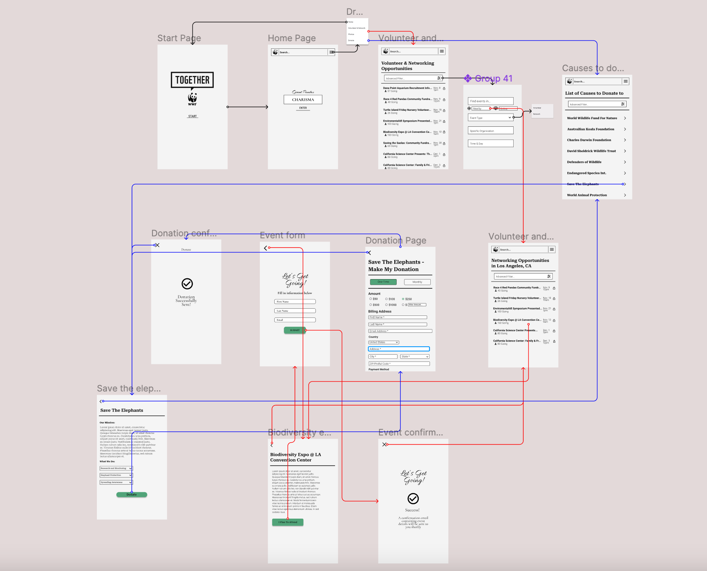

# Assignment 7: High-Fidelity Prototype

Giovanni Anguiano | DH110 | Fall 2022

## Overview

### Summary

This prototype is a redesign of the WWF Together app. This prototype aims to have easy and intuitive navigation to make it simpler for users to use and enjoy. This prototpye features two features that the current app's design lacks: volunteer and networking opportunites and links to donation.

### Process

This high-fidelity, interactive prototype was created based on several steps throughout the design process. First, the interactions included in this prototype were chosen based on observations made during usability testing and contextual analysis. Next, two user personas were created and assigned to a specific interaction, based on how much benefit it could bring to them related to their personal circumstances. Then, wireframes and wireflows were created as part of a low-fidelity prototype, which was tested with one user. Feedback from user informed changes made to the tentative design for certain interactions. These changes were then incorporated into into the high-fidelity, interactive prototype that was made using Figma.

### Purpose

The purpose of creating this high-fidelity prototype is to visualize the functional and UX/UI-related improvements that I would like to implement to WWF Together app. These functional and UX/UI-related improvements place great focus on easy navigation, something the app currently struggles with.

### Tasks

- Find a nearby networking event from the Volunteer and Networking opportunities tab using the advanced filter.
- Find causes to donate to and successfully donate to one organization

### Wireflow and final interface design

[Link to Wireflow](https://www.figma.com/file/PzSGoBQV2IA0qJgNrLsqNW/HiFi-Prototype?node-id=0%3A1&t=fkqg4UrdQMHF6CNr-1)

### Task 1 and 2 Flow

> **Task 1: Red**

> **Task 2: Blue**

